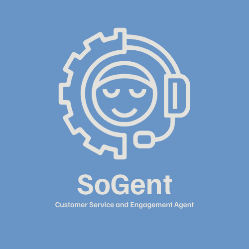
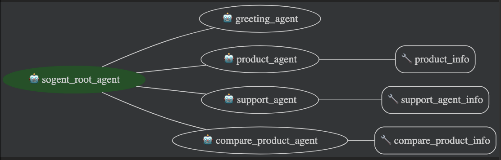

<p align="center">
  
</p>

# SoGent

**SoGent** is a Customer Service and Engagement platform that provides intelligent multi-agent virtual assistants, powered by Google ADK and Gemini, to handle complex customer inquiries, provide personalized support, and proactively engage with customers.

---

## Features

- **Multi-Agent System**: Modular agents for greetings, product info, support, and product comparison.
- **Google ADK & Gemini Integration**: Leverages Google ADK for agent orchestration and Gemini LLM for advanced AI responses.
- **Modern UI**: Beautiful, animated, and responsive frontend using Funnel Sans, FontAwesome, and custom CSS.
- **Website Knowledge**: Register websites, fetch their metadata, and use them as context for support and product queries.
- **Product Comparison**: Compare products with structured, professional responses.
- **Conversation History**: All user and AI interactions are stored for future reference.

---

## Architecture

<p align="center">
  
</p>

- **Frontend**: HTML, CSS, JS (Funnel Sans, FontAwesome)
- **Backend**: FastAPI, Google ADK, Gemini (google-genai)
- **Database**: Simple JSON file (`db.json`) for demo purposes

---

## Quick Start

1. **Clone the repository**
   ```bash
   git clone <repo-url>
   cd sogent
   ```
2. **Install backend dependencies**
   ```bash
   cd backend
   pip install -r requirements.txt
   ```
3. **Set up environment variables**
   - Create a `.env` file in `backend/` with your Google Gemini API key:
     ```env
     GOOGLE_API_KEY=your-gemini-api-key
     ```
4. **Run the backend server**
   ```bash
   uvicorn main:app --reload
   ```
5. **Open the app**
   - Visit [http://localhost:8000](http://localhost:8000) for the landing page
   - Visit [http://localhost:8000/support](http://localhost:8000/support) for the support agent UI

---

## Usage

- **Register a Website**: Use the sidebar in the support UI to add a website. The system fetches its name, icon, and description.
- **Chat with Agents**: Ask questions, request product info, compare products, or get website support. The right agent will handle your query.
- **Product Comparison**: Use natural language to compare products (e.g., "Compare iPhone 15 Pro Max with Samsung Galaxy S24 Ultra").

---

## Project Structure

```
backend/
  main.py
  requirements.txt
  agents/
    agents.py
    router.py
    schemas.py
  websites.py
  db.json
frontend/
  index.html
  support.html
  css/
    styles.css
  js/
    app.js
  images/
    logo.png
    logo-transparent.png
    architecture.png
```

---

## Tech Stack

- **Frontend**: HTML, CSS, JavaScript, Funnel Sans, FontAwesome
- **Backend**: FastAPI, Google ADK, google-genai, Pydantic
- **Database**: JSON file (for demo; can be replaced with a real DB)

---

## License

MIT License

---

<p align="center">
  
  <br>
  <b>SoGent &mdash; Intelligent Multi-Agent Customer Service Platform</b>
</p>
